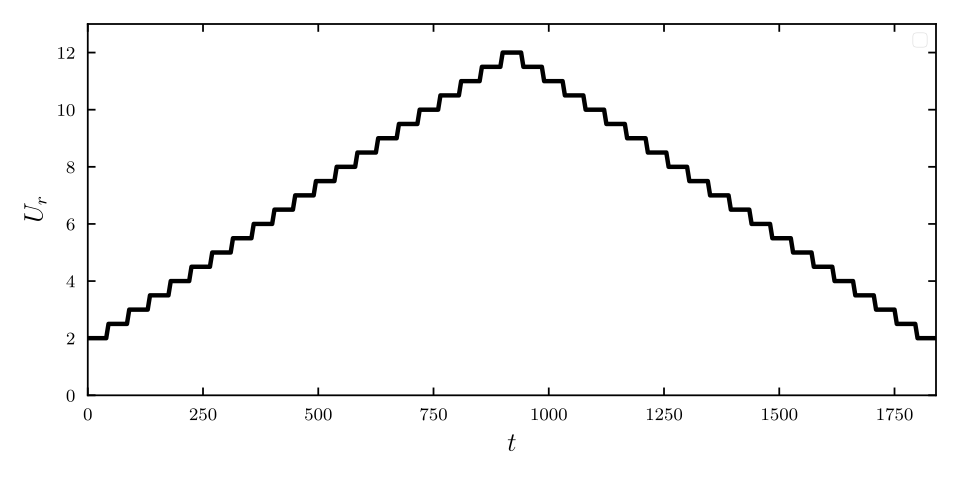
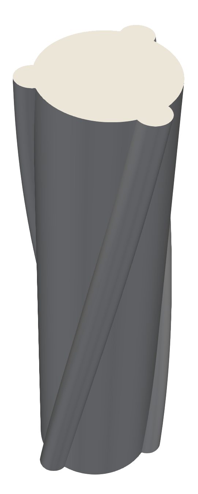

## Periodic vortex shedding and the von Kármán vortex street

When a fluid encounters a bluff body, such as a cylinder, it cannot follow the sharp curvature of the surface. This leads to boundary layer separation, where the flow detaches and forms two distinct shear layers. At low Reynolds numbers, these layers remain stable, but as the velocity increases, they begin to interact and roll up into discrete, concentrated vortices.

Crucially, these vortices do not shed simultaneously. Instead, they detach in an alternating, periodic fashion, creating the **von Kármán** vortex street: a staggered trail of swirling fluid that can persist for many diameters downstream. The frequency of this shedding ($f_s$) is predictable and is defined by the nondimensional Strouhal Number (St):
$f_s=\frac{St \cdot U}{D}$ where $U$ is the flow velocity and $D$ is the cylinder diameter.

::: {layout-ncol=1}
.](images/landsat_art_karman.jpg){group="none1" #fig-example}
:::

While this is a fundamental problem in fluid mechanics, we encounter its effects daily. A common example is the high-pitched whistling or humming produced by a car antenna at highway speeds. This sound is the acoustic signature of vortex shedding; as the air flows past the thin rod, the alternating vortices create pressure fluctuations that vibrate the air. This happens because as a vortex is "born" on one side of the cylinder, it creates a local region of high-velocity, low-pressure fluid. This generates a net lift force that pulls the cylinder toward the vortex. As the next vortex sheds from the opposite side, the pressure drop shifts, and the lift force reverses direction.

If the cylinder is rigid and fixed, it simply experiences these fluctuating loads as fatigue or noise. However, if the structure is elastic or mounted on springs (such as a car antenna, a bridge cable, or an offshore riser), this periodic forcing begins to move the structure.

When the shedding frequency ($f_s$) nears the natural frequency of the structure ($f_n$), the fluid and the structure begin to synchronize. The shedding frequency can actually shift to match the structural frequency, leading to a state called **lock-in**. The result is Vortex-Induced Vibrations (VIV): high-amplitude, self-sustaining oscillations that can lead to rapid structural failure. The transition from a static cylinder to a vibrating one marks the shift into the domain of Fluid-Structure Interaction (FSI). In this regime, the problem is no longer "one-way" (the fluid moving the cylinder), but a tightly coupled "two-way" feedback loop. As the cylinder moves, it alters the boundary conditions of the flow field, which in turn modifies the timing and strength of the vortex shedding.


## Vortex induced vibrations on a cylinder with two-degrees of freedom

To investigate this phenomenon, we propose a simplified system where a cylinder moves elastically in the $x$-$y$ plane. For solver validation, this study replicates the experimental results of Jauvtis and Williamson (2003) for a low mass ratio ($m^* = 2.6$).

**Simulation Parameters:**

* **Cylinder Diameter ($D$):** 0.05 m
* **Fluid:** Water
* **Natural Frequency ($f_n$):** 0.4 Hz
* **Reduced Velocity Range $\left( U_r = \frac{U}{f_n D}\right)$:** 2 to 12

While we expect maximum vibration amplitude near $U_r = 5$ (where $f_n \approx f_s$), the physical reality is more complex. The system exhibits *bistability* and *path-dependent hysteresis*, a phenomenon usually reserved for fields like electrodynamics rather than classical mechanics. Depending on whether the flow velocity is increasing or decreasing, the fluid-structure coupling remembers its previous state and locks into different response branches. This purely fluid-mechanical memory makes the system physically rich and difficult to simulate accurately.

### Numerical Modeling

Numerical simulations were performed using **OpenFOAM**, with computational domains generated as O-grids using the `blockMesh` utility. To assess the influence of turbulence modeling and three-dimensionality on VIV prediction, two approaches were compared:

* **2D RANS**: Utilizing the $k$-$\omega$ SST model.
* **3D LES**: Utilizing a $k$-equation sub-grid scale model or WALE (Wall-Adapting Local Eddy-viscosity) model.

#### Fluid-Structure Coupling and Mesh Motion

The structural response was modeled using a **six-degree-of-freedom (6-DoF)** rigid-body solver integrated within the `dynamicMesh` framework. The cylinder's motion is governed by a **Newmark-beta** ODE solver, which accounts for the hydrodynamic forces, structural mass, and damping. A custom restraint library was developed to implement a **nonlinear coupled spring model**. This allowed for the investigation of geometrical nonlinearities in the structural restoration forces.

To handle the domain deformation, two distinct methods were evaluated, with the **ALE** approach serving as the primary baseline for the study:

1. **Arbitrary Lagrangian-Eulerian (ALE)**: Utilizing the `dynamicMotionSolverFvMesh` class with a distance-based displacement Laplacian to morph the mesh around the moving cylinder.
2. **Overset (Chimera) Mesh**: Utilizing the `dynamicOversetFvMesh` class with a background mesh and a translated foreground component mesh to maintain high cell quality regardless of the oscillation amplitude. This method was used to verify the consistency of the overset solver against the ALE results.


::: {#fig-vortex-sim}
```{=html}
<video width="100%" height="auto" autoplay loop muted playsinline>
  <source src="images/lci_4.mp4" type="video/mp4">
</video>
```
Volumetric representation of the vortex shedding using the $\lambda_{ci}$ criterion, for an LES simulation at $U_r=6$.

:::


### Comparison of Mesh Motion Strategies

To visualize the fundamental differences between the two spatial updating techniques, the following animations show both methods solving the same dynamic response. 

The **ALE** method accommodates the cylinder's displacement through internal mesh deformation (morphing). An inner region near the wall moves rigidly, while the intermediate cells absorb the distortion. Conversely, the **Overset** method completely avoids geometric distortion. It maintains perfect cell orthogonality by sliding a rigid component mesh containing the cylinder over a static background domain.

::: {layout-ncol=2}

::: {#fig-mesh-ale}
```{=html}
<video width="100%" height="auto" autoplay loop muted playsinline>
  <source src="images/ALE_close1.mp4" type="video/mp4">
</video>

```

**Arbitrary Lagrangian-Eulerian (ALE):** Mesh morphing where internal vertices relocate to accommodate the boundary movement.
:::

::: {#fig-mesh-overset}

```{=html}
<video width="100%" height="auto" autoplay loop muted playsinline>
  <source src="images/overset1.mp4" type="video/mp4">
</video>

```

**Overset (Chimera):** A rigid foreground component mesh translating over an independent background mesh.
:::

:::


### Capturing Path-Dependent Hysteresis

To accurately model the hysteresis effect reported in the literature, the reduced velocity ($U_r$) was varied using an incremental stepped ramp.

* The velocity was increased in discrete steps.


* Stabilization periods were included at each step to allow the fluid-structure system to reach a steady state.


* This sweep was performed to capture the ascending branch for a reduced velocity range between 2 and 12.


* The procedure was subsequently reversed, gradually decreasing the velocity to evaluate the descending branch of the system.


::: {layout-ncol=1}
{#fig-Ur group="none1" width="50%"}
:::

### Results for the Linear System

The global dynamic response of the system was evaluated by comparing the 2D RANS and 3D LES simulations against established experimental data. The numerical models successfully captured the critical stages of the vortex-induced vibrations.

* **Lock-in and Synchronization:** The simulations accurately reproduced the lock-in region, where the system's oscillation frequency synchronizes with its natural frequency despite the increasing fluid velocity.


* **Amplitude Branches:** During the ascending sweep, the simulations successfully matched the initial branch and the transition to the high-amplitude upper branch. The transition to the lower branch occurred at a slightly lower velocity than observed in the experimental reference.


* **Figure-Eight Trajectories:** The cylinder's orbital paths in the $x$-$y$ plane evolved as expected, forming classic figure-eight shapes. In the upper branch, the trajectories displayed significant transverse extension and longitudinal curvature. After dropping to the lower branch, these orbits became notably narrower. To visualize this continuous evolution, the embedded animation tracks the cylinder's center point across the entire velocity sweep, illustrating the dynamic shift in the Lissajous curves as the system transitions between amplitude branches.


<div class="video-container">
  <iframe 
    width="100%" 
    height="450" 
    src="https://www.youtube.com/embed/cxheNCCwrf4" 
    title="YouTube video player" 
    frameborder="0" 
    allow="accelerometer; autoplay; clipboard-write; encrypted-media; gyroscope; picture-in-picture; web-share" 
    allowfullscreen>
  </iframe>
</div>


* **Solver Consistency:** Both the Arbitrary Lagrangian-Eulerian and the Overset mesh strategies yielded equivalent results for the evaluated amplitudes, validating the coherence between the two numerical approaches.


::: {layout-ncol=1}
{#fig-response-linear group="none1" width="70%"}
:::

::: {layout-ncol=1}
{#fig-linear-time group="none1"}
:::


### The Impact of Geometric Nonlinearity

To explore a more complex structural response, geometric nonlinearities were introduced to the stiffness model, setting the nonlinear coefficients for both axes to 0.7. This modification significantly altered the response branches and the interaction between the transverse and longitudinal degrees of freedom.

* **Altered Amplitude Profiles:** The nonlinear system exhibited a lower maximum amplitude in the upper branch compared to the linear configuration.


* **Extended Synchronization:** The high-amplitude oscillations persisted over a much wider range of velocities.


* **Delayed Transition:** The abrupt drop in amplitude toward the lower branch was delayed until $U_r$ reached 9, whereas the linear system transitioned much earlier.


* **Increased Stiffness:** This delayed transition is attributed to the system's stiffness increasing proportionally as the oscillation amplitude grows.


::: {layout-ncol=1}
{#fig-nonlinear-response group="none1" width="70%"}
:::

::: {layout-ncol=1}
{#fig-nonlinear-time group="none1"}
:::


## VIV Suppression: Implementation of Helicoidal Strakes

To mitigate the detrimental effects of Vortex-Induced Vibrations, passive flow control devices are often employed in offshore and structural engineering. The configuration for this new simulation was taken from the studies by Korkischko & Meneghini (2010) to evaluate the effectiveness of helicoidal strakes in suppressing these self-sustaining oscillations. 

The modified geometry consists of a cylinder fitted with three helicoidal strakes arranged at 120-degree intervals. The 3D CAD model was developed in SolidEdge, exported as an STL file, and then discretized into a computational grid using OpenFOAM's `snappyHexMesh` utility. Strakes function by breaking the spanwise correlation of the vortex shedding. Instead of forming a strong, synchronized von Kármán vortex street, the fluid separates at varying phases along the span of the cylinder. This three-dimensional flow disruption prevents the vortices from shedding uniformly along the length of the body, which significantly reduces the net fluctuating lift forces acting on the structure.


::: {layout-ncol=1}
{#fig-strakesSTL group="none1" width="20%"}
:::


To visually demonstrate the suppression effect, the side-by-side animation below compares the bare cylinder (left) with the straked cylinder (right), both operating at the exact same reduced velocity ($U_r = 6$). 


::: {#fig-helix-comparison layout-align="center"}
```{=html}
<video width="100%" height="auto" autoplay loop muted playsinline>
  <source src="images/HELIX.mp4" type="video/mp4">
</video>

```

Comparison of the dynamic response at $U_r=6$. Left: Bare cylinder exhibiting high-amplitude oscillations. Right: Cylinder with helicoidal strakes showing a clear suppression of the VIV response.
:::


For the bare cylinder, this velocity falls directly within the upper branch of the synchronization region, resulting in large-amplitude figure-eight movements. In contrast, the cylinder equipped with strakes shows a drastic reduction in transverse and longitudinal oscillation amplitude, fully validating the suppression capabilities of this passive control strategy.


### Conclusion

This study demonstrates the capability of OpenFOAM to accurately resolve strongly coupled fluid-structure interaction problems. By comparing dynamic mesh morphing (ALE) and overset (Chimera) techniques, the numerical models successfully captured the intricate dynamics of vortex-induced vibrations, including lock-in, path-dependent hysteresis, and the characteristic figure-eight trajectories. The simulations proved robust enough to handle the added complexity of geometric nonlinearities, accurately predicting the extended synchronization regime and the delayed transition between response branches. Finally, the successful implementation of helicoidal strakes highlighted the practical engineering value of this CFD framework, proving it to be a reliable tool for designing and evaluating passive flow control devices.


## References

Jauvtis, N., & Williamson, C. H. K. (2003). The effect of two degrees of freedom on vortex-induced vibration at low mass and damping. *Journal of Fluid Mechanics*.

Korkischko, I., & Meneghini, J. R. (2010). Experimental investigation of flow-induced vibration on isolated and tandem circular cylinders fitted with strakes. *Journal of Fluids and Structures*.


---

::: {.column-screen style="text-align: center; padding: 40px 20px; background-color: #eee8d5; border-top: 1px solid #d3af37; margin-top: 80px;"}

### Behind the Simulation

This project explores the delicate balance between fluid mechanics and structural dynamics. It serves as a rigorous test of advanced mesh motion algorithms and custom solver integration within a fluid-structure interaction (FSI) environment.

::: {.footer-list-container}
The workflow involved a comprehensive FSI simulation pipeline:

* **Preprocessing:** Defining the physical parameters to match experimental low-mass ratios and designing the 3D geometry for the helicoidal strakes.
* **Meshing:** Generating structured O-grids using `blockMesh` for the morphing approach, and assembling complex background and foreground grids for the overset method.
* **Solving:** Executing dynamic mesh simulations in **OpenFOAM** (comparing 2D RANS with 3D LES) and developing a custom C++ library to implement the geometric nonlinearities in the structural restoration forces.
* **Post-processing:** Utilizing **ParaView** and **Python** to visualize volumetric vortex shedding, track the cylinder's temporal displacement, and animate the continuous velocity sweeps.
* **Analysis:** Extracting frequency responses and oscillation amplitudes to map the bistable hysteresis branches and validate the effectiveness of passive suppression techniques.
:::

Think this is cool? I am always looking for interesting fluid dynamics problems to solve. Let's connect!

 [LinkedIn](https://www.linkedin.com/in/zunigasantiago/) |  [Email Me](mailto:santiago.zuniga@ib.edu.ar)

:::

