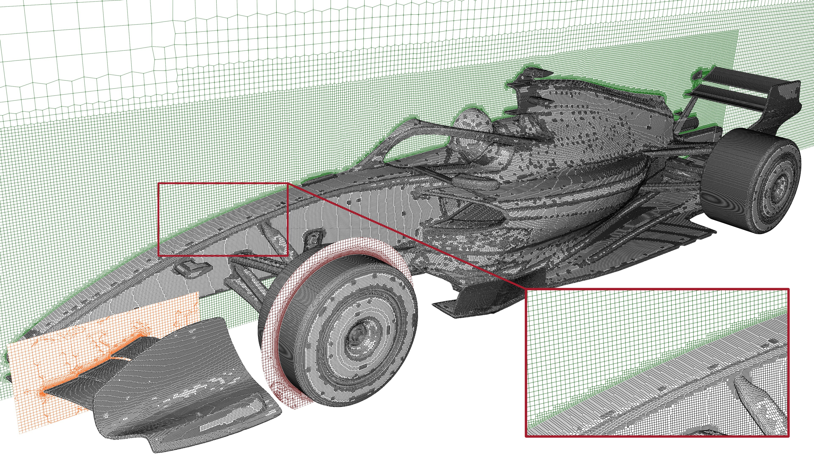
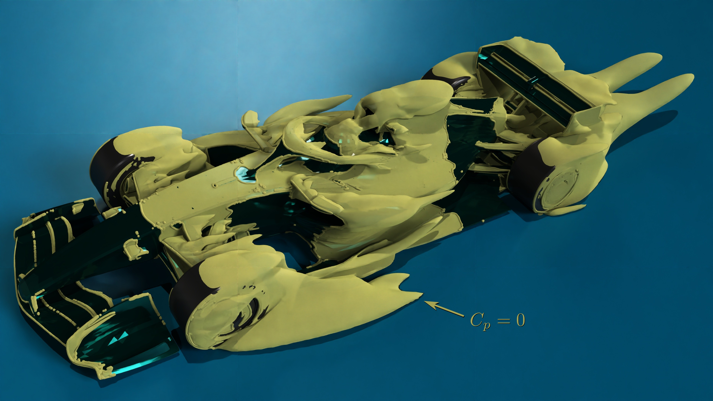
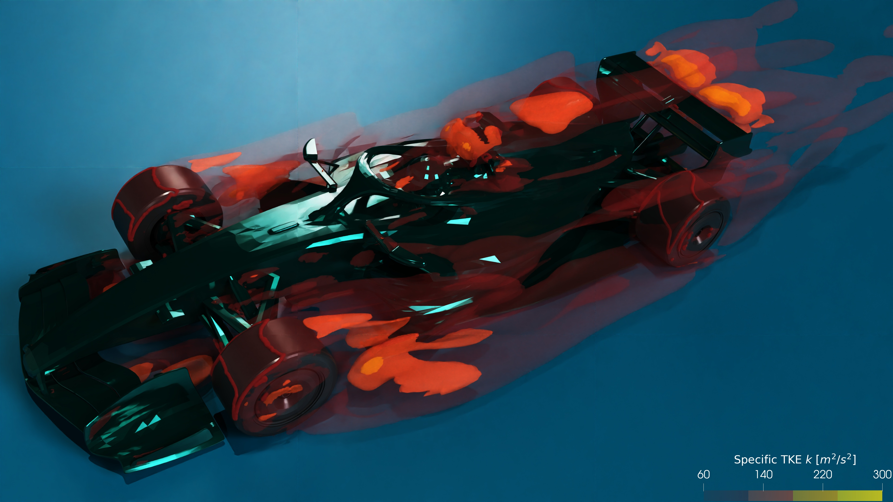
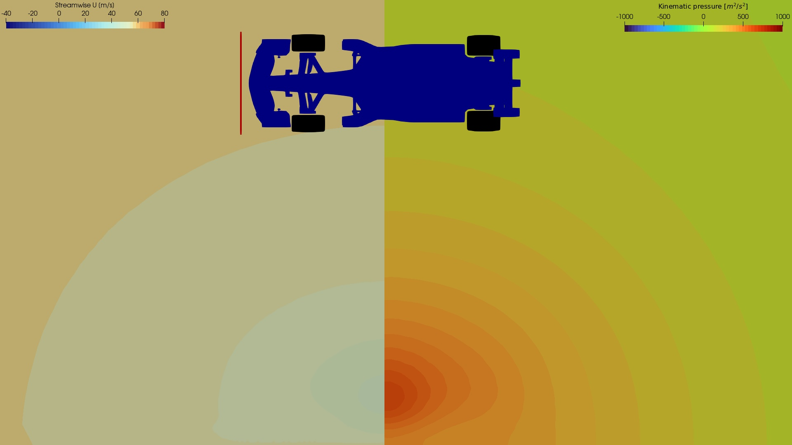
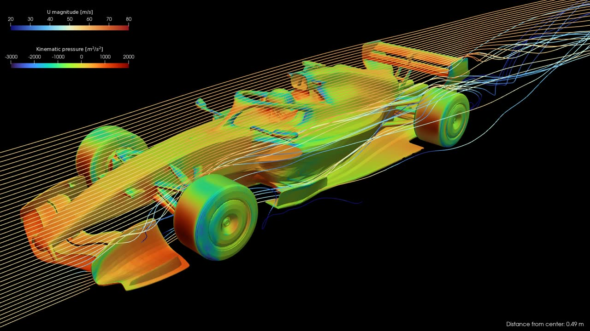
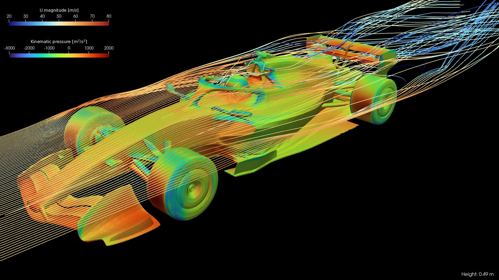
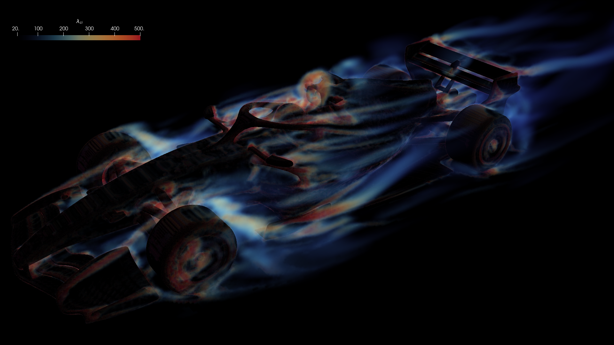

It should be of no surprise that I'm a fan of F1. I am a mechanical engineer with a fascination for aerodynamics, so... yeah. A few weeks ago I was discussing with some friends the utility of [Ferrari's little wing on their halo for the Chinese Grand Prix](https://www.motorsport.com/f1/news/f1-ferrari-the-missing-halo-flap-for-qualifying-wasnt-a-windshield/10806210/), and then I remembered I do CFD for a living, I should be able to have some fun with this in my free time. And I did. This page is by no means a complete and exhaustive aerodynamic study of the FIA 2026 regulations, but it's an interesting project nevertheless.


## Simulation details
First, to obtain a 3D model of a 2026 Formula One car, I used [this model](https://grabcad.com/library/formula1-2026-fia-showcar-1) based on the [FIA 2026 showcar](https://www.fia.com/news/new-era-competition-fia-showcases-future-focused-formula-1-regulations-2026-and-beyond), thanks to the uploader. I then modified it extensively in Blender to make it watertight, add a simplified driver, separate the wheels, empty the vents, and a myriad of other small adjustments.

The computational mesh was then generated using OpenFOAM’s `snappyHexMesh` utility, with significant refinement applied near the surface and boundary layers included. Two meshes were used: a smaller 2M-cell mesh for initial testing and a larger 11M-cell mesh for the final simulation, really pushing the limits of my laptop. The final mesh can be seen in Figure 1. Full disclaimer: the STL could have used more work to achieve a higher-quality mesh. We can see some random patches created by `snappyHexMesh` around spurious features of the STL file. Since this was a hobby project, I decided to move on.

::: {layout-ncol=1}
{group="none1"}
:::

The simulations were conducted using the `simpleFoam` solver for steady-state incompressible flow, utilizing the $k-\omega$ SST turbulence model. The car speed was chosen to be 200 km/h (56 m/s). For this, I set the usual inlet-outlet boundary conditions, plus the bottom wall (ground) moving at the same speed. The wheels' rotation was imposed using a Dirichlet boundary condition with the appropriate rotational speed. Only half of the car was simulated, using a symmetry boundary condition.


## Results
Before analysing the results, just as a quick recap of the 2026 aerodynamic regulations, the FIA is making some massive changes. The biggest shift is the move away from the ground effect era we have had since 2022. The complex Venturi tunnels under the car are gone, replaced by a much flatter floor and a larger rear diffuser. The aerodynamic surfaces themselves are also smaller overall, with a simpler, narrower front wing and a rear wing that ditches the lower beam element. Since the new 50/50 hybrid power units require a much more efficient car, there is a huge focus on active aerodynamics to compensate. Both the front and rear wings now feature movable elements that open up on the straights to shed drag, and then close up in the corners to provide downforce. We won't focus on the active aero part for now, but it's something I'd like to tackle in the near future.

We'll start by looking at the isosurface of $C_p=0$, as shown in the image below (Figure 2). $C_p$ stands for the pressure coefficient. It is a dimensionless number that compares the local static pressure at any point in the flow field to the freestream pressure. A positive $C_p$ means the pressure is higher than the ambient air, which typically happens where the flow is stagnating against a surface. A negative $C_p$ indicates suction, where the air is accelerating. Therefore, an isosurface of $C_p=0$ acts as a 3D boundary separating the regions of positive and negative pressure. Visualizing this specific surface is incredibly useful because it maps out the true aerodynamic wake of the car. 

Looking at the rendering, a few key aerodynamic features jump out immediately. First, the outwash effect is very prominent. You can clearly see the isosurface bulging outward around the front wheels. This confirms that the front wing and suspension elements are successfully doing their job of pushing the highly turbulent tire wake away from the vital aerodynamic surfaces downstream, like the floor edges and sidepods. The design of the endplates, footplates, and wakeboards is a key factor in this, and we can see a lot of variation between the teams during this season. 

Additionally, if we look down the centerline of the car, the isosurface hugs the engine cover tightly. This indicates that the flow is being funneled efficiently over the bodywork, arriving as clean as possible to the rear wing elements to maximize their efficiency in producing downforce.

::: {layout-ncol=1}
{group="results"}
:::

Moving on to the next visualization (Figure 3), we are looking at multiple isosurfaces of specific Turbulent Kinetic Energy, or $k$. To get a better look at the internal structure of the flow, I layered several isosurfaces here, mapping the color and transparency to the intensity of the turbulence. The dark red, highly transparent regions represent the outer boundaries of the turbulent wake, while the solid, bright orange areas show the intense inner cores where the turbulent energy is highest. TKE is a measure of the energy contained in the swirling, turbulent eddies within the fluid flow. Areas with high $k$ values represent highly turbulent air. In the context of motorsport, turbulence is often a source of aerodynamic drag and is the primary culprit behind the "dirty air" that makes it so difficult for cars to follow each other closely through corners. 

When we look at this render, the turbulent wake structures become very clear. The front tires, unsurprisingly, generate a massive amount of turbulence. While the pressure plot showed us the outwash effect pushing the air outward, this TKE plot shows the sheer amount of turbulent energy being wasted in that tire wake. 

Another striking feature is the bright orange, high-intensity core sitting right behind the driver's helmet. Open cockpits have always been an aerodynamic headache, and this visual perfectly highlights the concentrated, messy flow structures generated in that specific area. Finally, as the flow moves backward, we can see the wakes from the rear tires and the rear wing combining to form the massive, turbulent plume trailing behind the car.


::: {layout-ncol=1}
{group="results"}
:::


To better see how the flow evolves as it travels over the car, I put together this interactive slice explorer. By dragging the slider below, you can move a transverse plane from the front wing all the way to the rear wake. The view is split to show two different variables: the left side displays the streamwise velocity and the right side shows the kinematic pressure. Here are a few cool things to look out for as you play around with the slider:

* **The Outwash Effect:** As the slice hits the front wing and tires, look at the velocity field on the left. You will see a massive, low-velocity (blue) wake forming directly behind the tires. However, notice how that messy wake is being violently pushed outward and away from the center of the car. That is the front wing endplates doing their job, keeping that dirty air from getting sucked under the floor.
* **Spotting Vortices:** Keep a close eye on the pressure plot on the right side. You can actually identify streamwise vortices by looking for distinct, circular pockets of very low pressure. For instance, right at the beginning of the slider when the slice cuts through the front wing, you can spot a sharp dark blue core forming near the endplate. Later, as the slice moves past the front wheels and along the sidepods, you will see a prominent dark blue core forming just outside the floor edge. This is a powerful vortex rolling up, likely generated to help manage the turbulent wake from the front wheel. 
* **Floor Suction:** As you move the slice through the middle of the car (the sidepods), focus on the pressure plot on the right. You can clearly see the dark blue, low-pressure zones hugging the underside of the floor, effectively sucking the car into the ground to generate downforce. Although the ground effect is not so predominant in this season, it's still an important source of downforce.
* **The Halo and Driver Wake:** When the slice crosses the cockpit, you can see the velocity deficit caused by the halo and the driver's helmet. It is a very messy area of flow that travels straight back toward the engine cover and rear wing.
* **The Diffuser and Rear Wing:** Finally, as you reach the rear of the car, you can watch the diffuser expanding the air from underneath the floor, slowing it down to merge with the freestream. Above that, the rear wing is working heavily on the clean air that arrives to it. You can see a massive low-pressure zone underneath the main plane, and a huge, turbulent velocity wake trailing off into the distance behind the car. 


```{=html}
<div id="velocity-explorer" style="text-align: center; background: #f8f9fa; padding: 20px; border-radius: 12px;">
  
  
  <div style="margin-top: 15px;">
    <p><strong>Cross-section Position</strong></p>
    <input type="range" min="0" max="99" value="0" step="1" id="heightSlider" style="width:90%;">
  </div>

  <script>
    (function() {
      const slider = document.getElementById('heightSlider');
      const imgDisplay = document.getElementById('heightSliderImage');

      if (!slider || !imgDisplay) return;

      // Preload images for a smoother slider experience
      for (let i = 0; i <= 99; i++) {
        const img = new Image();
        const frameName = i.toString().padStart(4, '0');
        img.src = `images/slices_cut/3cut_xz.${frameName}.jpeg`;
      }

      // Update the image source when the slider moves
      slider.addEventListener('input', function() {
        const frameName = this.value.toString().padStart(4, '0');
        imgDisplay.src = `images/slices_cut/3cut_xz.${frameName}.jpeg`;
      });
    })();
  </script>
</div>
```


To wrap up the visual analysis, I built two more interactive tools, this time focusing on streamlines. While slices give us a great 2D look at the flow field, streamlines allow us to trace the air as it navigates around the car. In these renders, the lines are colored by velocity magnitude, and the car body itself is colored by kinematic pressure to tie everything together.

Here is a breakdown of what you can observe with each slider:

**Vertical Line Source (Moving Center to Outward)**

This first slider controls a vertical line of flow, moving it laterally from the centerline of the car out toward the wheels.

* **The Centerline:** When the slider is near zero, watch how the air perfectly tracks over the nose, splits around the halo, and feeds directly into the rear wing. 
* **Suspension and Sidepods:** As you drag the source outward, you can see the flow interacting with the complex front suspension geometry. You can also trace how the air wraps tightly around the undercut of the sidepods, driving that crucial flow toward the rear of the car.

**Horizontal Line Source (Moving Bottom to Top)**

The second slider controls a horizontal line source, moving it vertically from just above the ground all the way up to the top of the roll hoop.

* **Feeding the Floor:** When the source is low to the ground, you can see the air diving under the front wing and channeling straight into the floor inlets. This perfectly highlights how the remaining ground effect structures are fed with high-velocity air.
* **Over-body Flow:** As you move the slider higher, you can trace the air flowing over the top of the sidepods, getting pushed aside by the front tires, and eventually clearing the driver's helmet and airbox. 


```{=html}
  <div id="streamline-ver-explorer" style="text-align: center; background: #f8f9fa; padding: 20px; border-radius: 12px;">
  
  
  <div style="margin-top: 15px;">
    <p><strong>Lateral Position</strong></p>
    <input type="range" min="1" max="50" value="25" step="1" id="sliderVer" style="width:90%;">
  </div>

  <script>
    (function() {
      const sliderVer = document.getElementById('sliderVer');
      const imgDisplayVer = document.getElementById('sliderImageVer');

      if (!sliderVer || !imgDisplayVer) return;

      for (let i = 1; i <= 50; i++) {
        const img = new Image();
        const frameName = i.toString().padStart(4, '0');
        img.src = `images/slices_streamVer/opt_2stream_ver.${frameName}.jpeg`;
      }

      sliderVer.addEventListener('input', function() {
        const frameName = this.value.toString().padStart(4, '0');
        imgDisplayVer.src = `images/slices_streamVer/opt_2stream_ver.${frameName}.jpeg`;
      });
    })();
  </script>
</div>
```


```{=html}
<div id="streamline-hor-explorer" style="text-align: center; background: #f8f9fa; padding: 20px; border-radius: 12px; margin-bottom: 30px;">
  
  
  <div style="margin-top: 15px;">
    <p><strong>Vertical Position</strong></p>
    <input type="range" min="1" max="50" value="25" step="1" id="sliderHor" style="width:90%;">
  </div>

  <script>
    (function() {
      const sliderHor = document.getElementById('sliderHor');
      const imgDisplayHor = document.getElementById('sliderImageHor');

      if (!sliderHor || !imgDisplayHor) return;

      for (let i = 1; i <= 50; i++) {
        const img = new Image();
        const frameName = i.toString().padStart(4, '0');
        img.src = `images/slices_streamHor/opt_2stream_hor.${frameName}.jpeg`;
      }

      sliderHor.addEventListener('input', function() {
        const frameName = this.value.toString().padStart(4, '0');
        imgDisplayHor.src = `images/slices_streamHor/opt_2stream_hor.${frameName}.jpeg`;
      });
    })();
  </script>
</div>
```

Finally, as a last visualization (Figure 4), I wanted to look specifically at swirling strength, denoted as $\lambda_{ci}$. Unlike TKE, which captures turbulent energy, $\lambda_{ci}$ strictly identifies the actual core of swirling vortices within the flow field. High scalar values (the bright red and orange regions) represent areas of intense local rotation.

A particularly interesting result is how effective the front wing is at conditioning the flow, even on a simplified model like this that lacks intricate strakes. You can clearly trace the intense, streamwise outwash vortex generated by the interaction between the main plane and the endplate. Look at that bright orange "tube" propagating outwards, perfectly demonstrating how the front wing generates a vortex to sweep the highly turbulent tire wake outward, keeping that dirty air well clear of the vital floor edges downstream.

You can also clearly see the complex vortex structures forming at the tip of the rear wing, contributing to drag, as well as the initial formation of vortices along the edge of the floor aimed at maximizing suction.


::: {layout-ncol=1}
{group="results"}
:::


## Final remarks
This project was a fantastic deep dive into the FIA 2026 regulations. While it is just a hobby simulation pushing the limits of a personal laptop, it perfectly highlights the core aerodynamic philosophies the FIA is aiming for with the next generation of cars, showcasing a cleaner and simplified aerodynamic package.

Of course, with any CFD study, there is always room for improvement. If I were to iterate on this, I would spend more time cleaning the STL to refine the surface mesh further. I definitely want to tackle the active aero states for the front and rear wings in a future update. 

As a mechanical engineer with a background in complex, high-fidelity fluid dynamics simulations, applying these computational tools to motorsport is exactly the kind of challenge I enjoy doing. 


::: {.column-screen style="text-align: center; padding: 40px 20px; background-color: #eee8d5; border-top: 1px solid #d3af37; margin-top: 80px;"}
### Behind the Simulation

What started as a casual debate with friends over Ferrari's aerodynamic choices quickly escalated into a full multi-weekend project. Since I run fluid dynamics simulations for a living, I figured the best way to understand the ongoing 2026 Formula One regulations was to just model them myself. Using a model based on the FIA showcar as a baseline, this study is a hands-on exploration of the complex aerodynamics and flow structures that will define the next era of motorsport.

::: {.footer-list-container}
The workflow involved a complete CFD pipeline:

* **Preprocessing:** Sourcing a baseline 3D model and extensively modifying it in **Blender** (making it watertight, adding a simplified driver, separating the wheels, and opening the vents) to create an analysis-ready STL file.
* **Meshing:** Generating a high-fidelity computational grid using `snappyHexMesh`, complete with boundary layer addition and targeted surface refinement.
* **Solving:** Executing steady-state incompressible flow simulations (`simpleFoam`) within the **OpenFOAM** environment, utilizing the $k-\omega$ SST turbulence model alongside moving ground and rotating wheel boundary conditions.
* **Post-processing:** Utilizing **ParaView** to calculate and visualize complex variables like turbulent kinetic energy and swirling strength. All high-fidelity, ray-traced renderings featured in this study were generated entirely within the software.
* **Analysis:** Interpreting local flow phenomena, such as outwash generation and vortex core formation, to understand the aerodynamic intent behind the new regulations.
:::

Think this is cool? I am always looking for interesting fluid dynamics problems to solve. Let's connect!

 [LinkedIn](https://www.linkedin.com/in/zunigasantiago/) |  [Email Me](mailto:santiago.zuniga@ib.edu.ar)

:::


