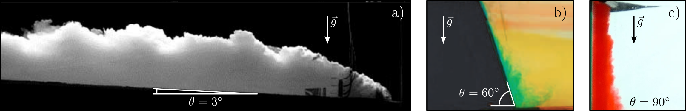
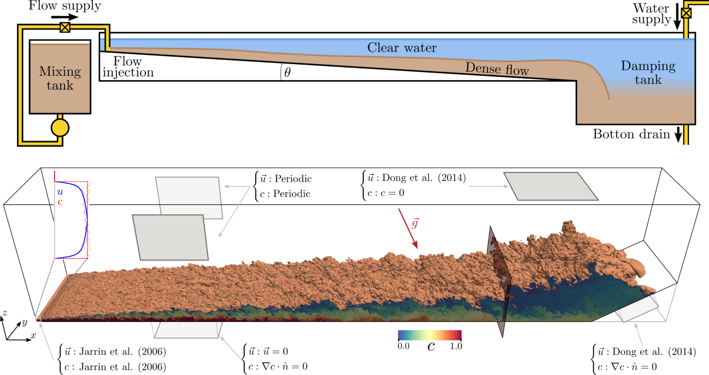
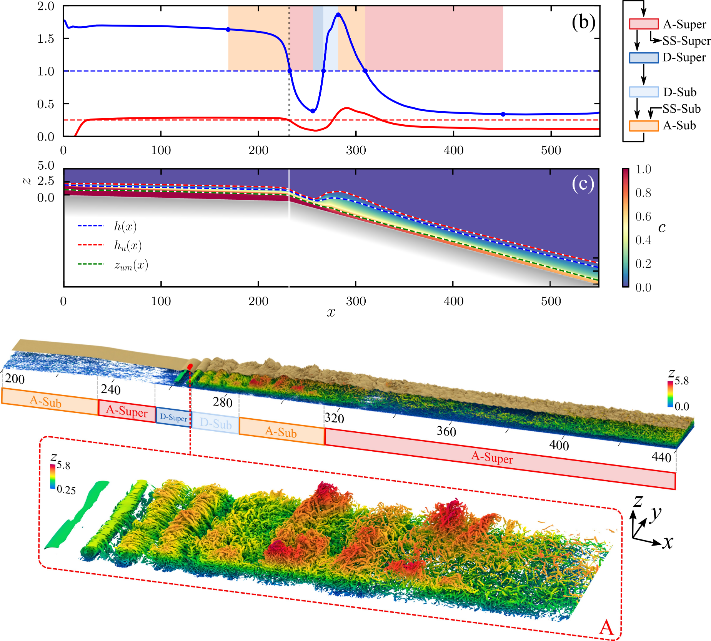
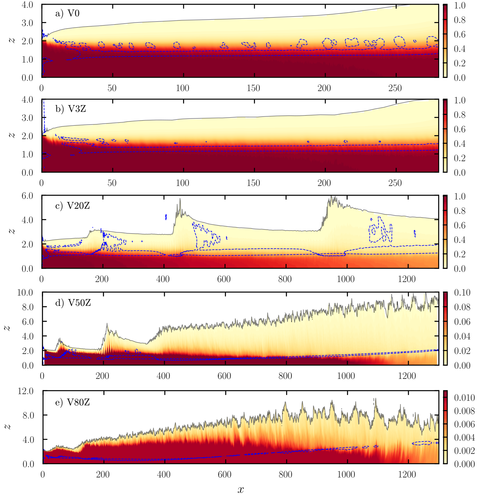
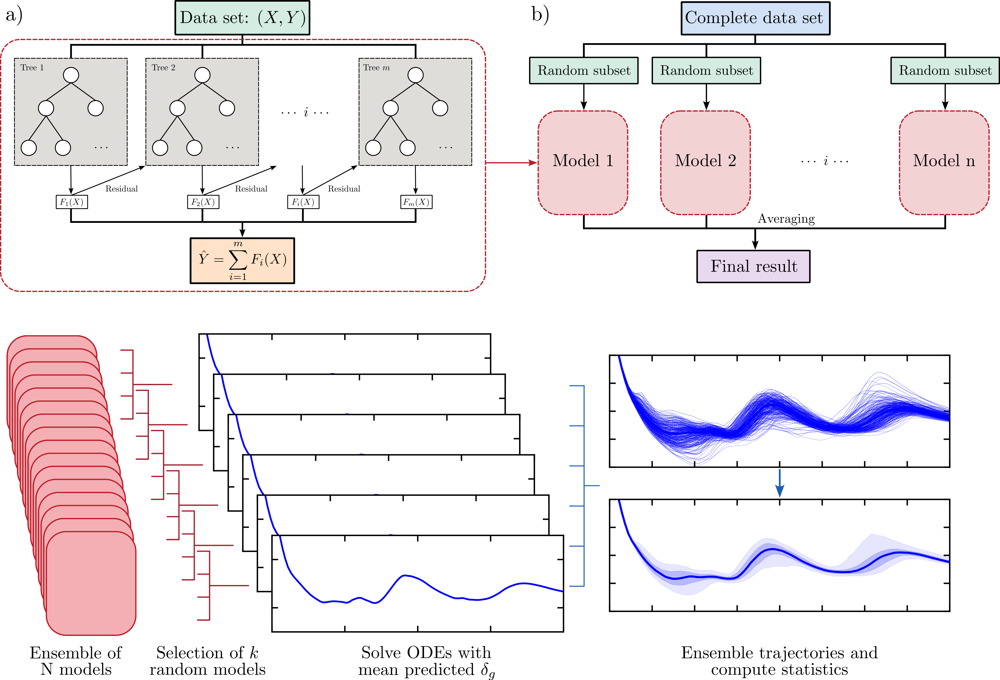

This page serves as a *very* brief introduction to my Ph.D. thesis, product of a collaboration between Instituto Balseiro and the University of Florida, under the guidance of [Dr. M. Cantero](https://scholar.google.com/citations?user=rvzQJV0AAAAJ&hl=en) and [Dr. S. Balachandar](https://scholar.google.com/citations?user=n1qenYwAAAAJ&hl=en). The full text can be read [here](https://doi.org/10.5281/zenodo.18925025).

## Buoyancy-driven flows

Anyone who has watched footage of a snow avalanche or a volcanic eruption has witnessed a buoyancy-driven flow in action. These powerful phenomena occur when density differences within a fluid cause it to move under the influence of gravity. If a fluid is lighter than its surroundings, it rises like smoke from a fire. If it is denser, it cascades downwards, forming what we call a gravity current.

When that density difference is caused by suspended sediment, the phenomenon is known as a turbidity current. These underwater storms are among the most massive agents of sediment transport on Earth. They scour the seafloor, travel for thousands of kilometers, and leave behind deposits that often become major petroleum reservoirs.

Because these flows occur in hazardous or inaccessible environments, measuring them in the field is incredibly difficult. This brings up an important challenge: how do we understand and predict their complex, destructive dynamics? We answer that by using Computational Fluid Dynamics (CFD) to recreate these extreme environments virtually.

::: {layout-ncol=1}
{group="none1"}
:::

## Simulation details

To capture the true complexity of these flows, simple models are not enough. The turbulence within gravity currents operates on multiple scales, requiring highly resolved Direct Numerical Simulations (DNS) and Large-Eddy Simulations (LES).

To resolve the near-wall turbulence and complex boundary layers, the computational domains contained up to 2.6 billion degrees of freedom. Running these cases required serious computational resources. The simulations were executed on high-performance computing clusters, utilizing up to 2024 AMD EPYC CPU cores and scaling up to 1000 NVIDIA A100 GPUs on the HiPerGator AI supercomputer. In total, the project consumed thousands of computing hours.

The numerical formulation relied on highly accurate spectral element methods, ensuring that the tiny turbulent eddies responsible for mixing and sediment transport were perfectly captured. 

::: {layout-ncol=1}
{group="none1"}
:::

## Results

Now, let us examine some of the simulation results. Traditionally, gravity currents are classified into steady subcritical or supercritical states based on a parameter called the Richardson number. However, the high-fidelity simulations revealed a much more dynamic reality.

When currents are perturbed from their stable states, they do not just monotonically settle into a new equilibrium. Instead, they enter a intermediate transcritical regime. We identified a universal cyclic evolution where the current constantly oscillates between four distinct states of acceleration and deceleration.

::: {layout-ncol=1}
{group="none1"}
:::

Another major factor in these underwater storms is the weight of the sediment. The settling velocity of the particles dictates the entire flow regime. Fast-settling, heavy particles force the flow into a stable supercritical state regardless of the bed slope. On the other hand, intermediate settling velocities trigger the complex cyclic transitions mentioned above, creating entirely different turbulent structures.

::: {layout-ncol=1}
{group="none1"}
:::

Next, what happens if we tilt the floor until it becomes a vertical wall? This creates a wall plume, which is essentially an extreme gravity current acting at a 90-degree angle, or a smoke plume rising near a wall. Simulating these vertical plumes allowed me to characterize how the turbulent kinetic energy and drag forces behave when gravity acts parallel to the boundary.

::: {layout-ncol=1}
{group="none1"}
:::

Finally, is there a way to make this high-level data useful for reservoir engineering? Running billion-cell DNS for every real-world submarine canyon is simply impossible. To get around this, engineers use simplified "depth-averaged" models. The catch is that these simple models often fail or give inaccurate predictions during the transient phases of the flow. To get around this, I treated the massive DNS datasets as a training ground for Machine Learning. I developed a novel data-driven closure strategy using an eXtreme Gradient Boosting (XGBoost) algorithm. By mapping the complex local flow properties to the missing variables in the simple equations, the predictive accuracy of the depth-averaged models improved drastically. To make sure the model was robust, I also integrated Monte Carlo subsampling to quantify the predictive uncertainty. 

::: {layout-ncol=1}
{group="none1"}
:::

## Some remarks

So, what have we learned? While the multiscale simulations give us beautiful turbulent structures, they also give us invaluable insight on the internal structure of gravity currents and its relation to their global behaviour.

Whether it is a turbidity current carving out the ocean floor or a thermal plume rising against a wall, we can draw some conclusions:

* The transition between different flow states is not a sharp boundary, but a complex cycle of acceleration, deceleration, and turbulent mixing.
* Sediment properties completely dictate the stability of the flow.
* By combining high-fidelity CFD with Machine Learning, we can build the next generation of predictive models for geophysical applications.

The results shown here remark the importance of advanced computational methods for understanding the natural world, giving us the tools to predict the behavior of massive flows.

---

## References

* <u>Zúñiga, S. L.</u>, Balachandar, S., Yang, Y., Zhang, Y., Smith, K., Loppi, N., Cantero, M. I., & Kerkemeier, S. (2024). Planar Wall Plumes Bounded by Vertical and Inclined Surfaces. *Physics of Fluids*, 36(3). [https://doi.org/10.1063/5.0200072](https://doi.org/10.1063/5.0200072)
* Salinas, J. S., Balachandar, S., <u>Zúñiga, S. L.</u>, Shringarpure, M., Fedele, J., Hoyal, D., & Cantero, M. I. (2023). On the Definition, Evolution, and Properties of the Outer Edge of Gravity Currents: A Direct-Numerical and Large-Eddy Simulation Study. *Physics of Fluids*, 35(1). [https://doi.org/10.1063/5.0138187](https://doi.org/10.1063/5.0138187)
* Salinas, J. S., <u>Zúñiga, S. L.</u>, Cantero, M. I., Shringarpure, M., Fedele, J., Hoyal, D., & Balachandar, S. (2022). Slope Dependence of Self-Similar Structure and Entrainment in Gravity Currents. *Journal of Fluid Mechanics*, 934. [https://doi.org/10.1017/jfm.2022.1](https://doi.org/10.1017/jfm.2022.1)
* <u>Zúñiga, S. L.</u>, Salinas, J. S., Balachandar, S., & Cantero, M. I. (2022). Universal Nature of Rapid Evolution of Conservative Gravity and Turbidity Currents Perturbed from Their Self-Similar State. *Physical Review Fluids*, 7(4). [https://doi.org/10.1103/PhysRevFluids.7.043801](https://doi.org/10.1103/PhysRevFluids.7.043801)
* Salinas, J. S., Balachandar, S., Shringarpure, M., Fedele, J., Hoyal, D., <u>Zúñiga, S. L.</u>, & Cantero, M. I. (2021). Anatomy of Subcritical Submarine Flows with a Lutocline and an Intermediate Destruction Layer. *Nature Communications*, 12(1), 1649. [https://doi.org/10.1038/s41467-021-21966-y](https://doi.org/10.1038/s41467-021-21966-y)

---

::: {.column-screen style="text-align: center; padding: 40px 20px; background-color: #eee8d5; border-top: 1px solid #d3af37; margin-top: 80px;"}

### Behind the Simulation

This project was a deep dive into the fundamental physics of buoyancy-driven flows, pushing the limits of what we can resolve numerically. It combined traditional fluid mechanics with data science to bridge the gap between microscopic turbulence and macroscopic engineering models.

The workflow involved a complete multiscale pipeline:

* **Preprocessing:** Formulating complex open boundary conditions and generating synthetic turbulent inlets to sustain realistic flow physics.
* **Solving:** Executing massive Direct Numerical Simulations (DNS) and Large-Eddy Simulations (LES) across thousands of CPU cores and GPU clusters.
* **Analysis:** Processing terabytes of velocity and concentration fields to extract momentum balances, turbulent kinetic energy budgets, and structural insights.
* **Machine Learning:** Developing a robust XGBoost regression ensemble to upgrade traditional depth-averaged equations, complete with uncertainty quantification.

Think this is cool? I am always looking for interesting fluid dynamics problems to solve. Let's connect!

[LinkedIn](https://www.linkedin.com/in/zunigasantiago/) | [Email Me](mailto:santiago.zuniga@ib.edu.ar)

:::